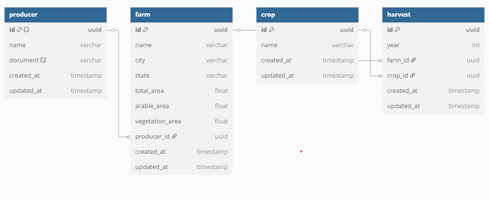

# 🌾 Brain Agriculture

Aplicação full-stack para cadastro e gestão de produtores rurais, fazendas, culturas e safras.  
Monorepo com **NestJS + PostgreSQL** no backend e **React + Vite + Redux Toolkit** no frontend.

---

## 📦 Estrutura do Projeto

```
brain-agriculture/
├── apps/
│   ├── backend/      # API NestJS + TypeORM + PostgreSQL
│   └── frontend/     # React + Vite + Redux Toolkit
├── libs/             # Tipos e utilitários compartilhados
├── docker-compose.yml
├── step-by-step.md   # Guia de implementação e checklist
├── PROJECT.md        # Documentação técnica e visão de negócio
└── ...
```

---

## 🚀 Como rodar o projeto (Docker Compose)

### 1. Pré-requisitos
- [Docker](https://www.docker.com/) e [Docker Compose](https://docs.docker.com/compose/)
- [pnpm](https://pnpm.io/) (`npm install -g pnpm`) **(apenas se for rodar localmente, não necessário para docker-compose)**

### 2. Configuração de variáveis de ambiente
- Copie `.env.example` de cada app para `.env` e ajuste se necessário.
- Exemplo para o backend (`apps/backend/.env`):
  ```ini
  DB_HOST=postgres
  DB_PORT=5432
  DB_USER=postgres
  DB_PASS=postgres
  DB_NAME=brain_agriculture
  ```

### 3. Subindo toda a stack (backend, frontend e banco)
```sh
docker-compose up --build
```
- Backend: http://localhost:3000
- Frontend: http://localhost:5173
- Swagger: http://localhost:3000/api/docs

### 4. Rodando localmente (opcional, sem Docker)
- **Backend:**
  ```sh
  cd apps/backend
  pnpm install
  pnpm start:dev
  ```
- **Frontend:**
  ```sh
  cd apps/frontend
  pnpm install
  pnpm dev
  ```

---

## 🛠️ Scripts Úteis

- `pnpm migration:generate` — Gera nova migration baseada nas entidades
- `pnpm migration:run` — Aplica as migrations no banco
- `pnpm migration:revert` — Reverte a última migration
- `docker-compose up -d` — Sobe todos os serviços em background
- `pnpm test` — Roda os testes unitários

---

## 📚 Documentação e Arquitetura

- **Documentação técnica:** veja `PROJECT.md`
- **Checklist de implementação:** veja `step-by-step.md`
- **Swagger:** http://localhost:3000/api/docs

---

## ✅ Checklist de Implementação (resumo do step-by-step.md)

- Estrutura monorepo com workspaces pnpm
- Backend modular (NestJS, TypeORM, PostgreSQL)
- Frontend com atomic design, Redux Toolkit, RTK Query
- CRUD completo para produtores, fazendas, culturas e safras
- Validações de CPF/CNPJ e regras de área
- Dashboard analítico no frontend (gráficos, totais, filtros)
- Logger estruturado (nestjs-pino)
- Testes unitários e de integração no backend
- Dockerfile e docker-compose para toda stack
- Swagger e documentação dos endpoints

### 🚧 O que falta / próximos passos
- [ ] Testes unitários para componentes e hooks do frontend
- [ ] Cobertura mínima de 80% nos testes frontend
- [ ] Configurar ESLint, Prettier, Husky e lint-staged
- [ ] Adicionar métricas Prometheus no backend (`/metrics`)
- [ ] Badge de status do CI no README
- [ ] Criar diagrama de entidades (ex: dbdiagram.io)
- [ ] Melhorar README com exemplos de uso da API

---

## 🐞 Troubleshooting
- **Banco não conecta?**
  - Verifique se o Postgres está rodando (`docker ps`).
  - Confirme a porta correta (`5432` no container).
  - Confira as variáveis de ambiente do backend.
- **Migrations não aplicam?**
  - Gere e rode as migrations sempre que alterar entidades.
- **Frontend não acessa API?**
  - Verifique a variável `VITE_API_URL` no frontend.
- **Erro de índice corrompido nos métodos PUT?**
  - Execute o script de correção: `chmod +x scripts/fix-db.sh && ./scripts/fix-db.sh`
  - Ou execute manualmente: `docker-compose exec postgres psql -U postgres -d brain_agriculture -c "REINDEX SYSTEM brain_agriculture;"`

---

## 📄 Licença

MIT

---

> Para detalhes técnicos, regras de negócio e visão geral, consulte também os arquivos `PROJECT.md` e `step-by-step.md`.

---

## 🗺️ Diagrama de Entidades

Abaixo está o diagrama de entidades do domínio, gerado via [dbdiagram.io](https://dbdiagram.io/):



- **Producer** (produtor) possui várias **Farms** (fazendas)
- **Farm** pode ter várias **Harvests** (safras)
- Cada **Harvest** está associada a uma **Crop** (cultura)
- Relacionamentos e constraints seguem as regras de negócio do projeto

> O arquivo DBML utilizado para gerar o diagrama está disponível no repositório e pode ser editado conforme evolução do projeto. 